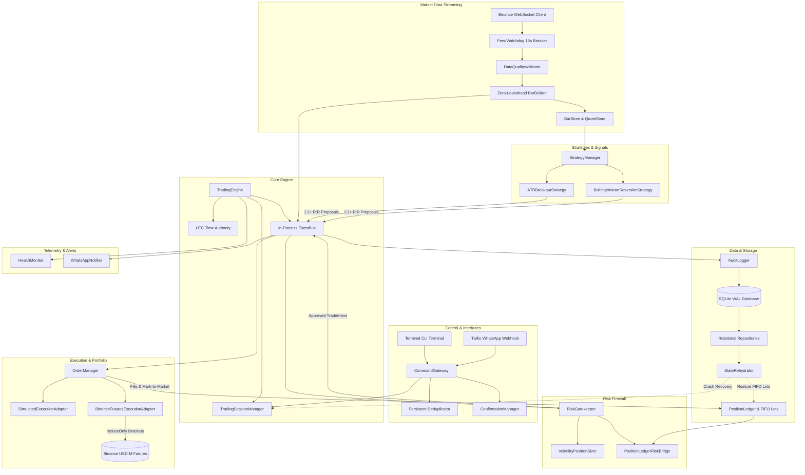

# Trad-Auto

**Institutional-Grade Automated Quantitative Trading & Risk-Management Platform for Crypto**

[](https://www.python.org/downloads/)
[]()
[-brightgreen.svg)]()
[]()
[](https://github.com/astral-sh/ruff)

Trad-Auto is a personal automated quantitative trading system built with pure `Decimal` mathematical precision, asynchronous event-driven architecture, and strict fail-closed safety guardrails. It enforces the immutable cardinal rule:

$$\textbf{Capital Protection First, Profitability Second}$$

---

## 🏛️ Platform Architecture



---

## ⚡ Key Highlights & Guarantees

1. **Zero Floating-Point Drift**: All balance accounting, prices, fees, position sizes, and P&L metrics strictly utilize Python's `decimal.Decimal`. Standard binary floats are forbidden.
2. **Double-Lock Live Safety**: Live execution is blocked fail-closed unless both `ENABLE_LIVE_TRADING=true` and `CONFIRM_REAL_MONEY_TRADING="I_UNDERSTAND_AND_ACCEPT_CAPITAL_RISK"` are satisfied.
3. **Mandatory `reduceOnly` Protective Brackets**: All Stop-Loss and Take-Profit orders sent to Binance Futures strictly include `reduceOnly=True`, mathematically guaranteeing protective orders cannot accidentally open opposing leveraged positions.
4. **4 Financial Risk Limits**:
   - Daily maximum net loss limit (triggers automated transition to `RISK_LOCKED`).
   - Daily profit target lock (pauses trading to preserve gains).
   - Maximum portfolio gross exposure ceiling.
   - Strict 1:2+ minimum Risk-to-Reward ratio on all entry proposals.
5. **Feed Staleness Circuit Breaker**: Continuous `FeedWatchdog` monitors real-time streaming heartbeats. If feeds silence for > 15 seconds, feeds transition to `STALE`, dropping downstream entries fail-closed.
6. **Reboot Resilience**: Relational SQLite in WAL mode with `StateRehydrator` automatically restores active unexpired sessions, cash balances, and open FIFO lots upon reboot.

---

## 🚀 Quickstart

### 1. Installation

```bash
# Clone the repository
git clone https://github.com/rc4911234-glitch/AutoTrade.git
cd AutoTrade

# Create virtual environment
python -m venv .venv
source .venv/bin/activate  # On Windows: .venv\Scripts\activate

# Install dependencies and dev tools
pip install -e ".[dev]"
```

### 2. Configuration

Copy `.env.example` to `.env` and configure your settings:

```bash
cp .env.example .env
```

### 3. Running Trad-Auto

#### Web Dashboard & Background Daemon Mode (Production)
```bash
python -m trad_auto.main --daemon
```
Once started, open the Live Radar Dashboard in your browser:
* **Dashboard URL:** `http://localhost:5000/dashboard`
* **Real-time Telemetry:** `http://localhost:5000/api/status`

#### Interactive Terminal CLI Mode
```bash
python -m trad_auto.main --interactive
```

Available terminal & dashboard commands:
- `status`: Show current session state, P&L, and ML model conviction.
- `start paper 1000`: Request authorization for ₹1,000 paper trading budget.
- `confirm start <code>`: Confirm session activation with short code.
- `retrain ml`: Trigger an immediate on-demand ML retraining cycle.
- `positions`: Inspect active open positions and mark-to-market valuations.
- `pnl today`: Show realized and unrealized P&L today.
- `pause` / `resume`: Pause or resume entry monitoring.
- `stop`: Stop trading session (open positions remain protected).
- `kill`: Emergency Kill Switch (immediately flattens positions and halts).
- `confirm reset <code>`: Reset kill switch after emergency.

---

## 🐳 Docker Deployment

Run Trad-Auto as a hardened, non-root production container:

```bash
# Build and start container in background
docker compose up -d

# Check real-time logs
docker compose logs -f

# Check container health status
docker inspect --format='{{json .State.Health}}' trad_auto_engine
```

---

## 🧪 Quality Gates & Verification

Trad-Auto enforces zero-tolerance quality gates:

```bash
# 1. Code Linting (0 errors)
ruff check .

# 2. Formatting (0 errors)
ruff format --check .

# 3. Static Type Checking (0 errors)
mypy --strict config trad_auto tests

# 4. Full Test Suite & Coverage (292 passed, 92% coverage)
pytest --cov=config --cov=trad_auto tests/unit
```

---

## 📁 Repository Structure

```
├── config/                     # Settings and environment validation
├── trad_auto/
│   ├── core/                   # Domain models, event bus, clock, enums
│   ├── command/                # Gateway, deduplication, confirmation, CLI
│   ├── market_data/            # Bar builder, stores, validators, WebSockets
│   ├── indicators/             # Streaming indicators (SMA, EMA, ATR, RSI, Bollinger)
│   ├── strategies/             # ATR breakout, Bollinger mean reversion, manager
│   ├── risk/                   # 4 Financial limits gatekeeper, position sizer, bridge
│   ├── portfolio/              # Multi-currency balance, FIFO lot tracking, ledger
│   ├── execution/              # Order state machine, simulated & Binance adapters
│   ├── communication/          # Twilio WhatsApp adapter, signature validation
│   ├── persistence/            # SQLite WAL database, repositories, audit logger
│   ├── backtest/               # Event-driven backtester and performance metrics
│   ├── health.py               # Health monitor, vitals telemetry, container check
│   ├── engine.py               # Unified TradingEngine orchestrator
│   └── main.py                 # CLI entrypoint and signal handling daemon
├── tests/
│   └── unit/                   # 292 comprehensive unit and integration tests
├── Dockerfile                  # Hardened non-root multi-stage Docker build
├── docker-compose.yml          # Production Compose specification with volumes
└── pyproject.toml              # Packaging and toolchain configuration
```

---

## 📜 License

Private & Proprietary. All rights reserved.
